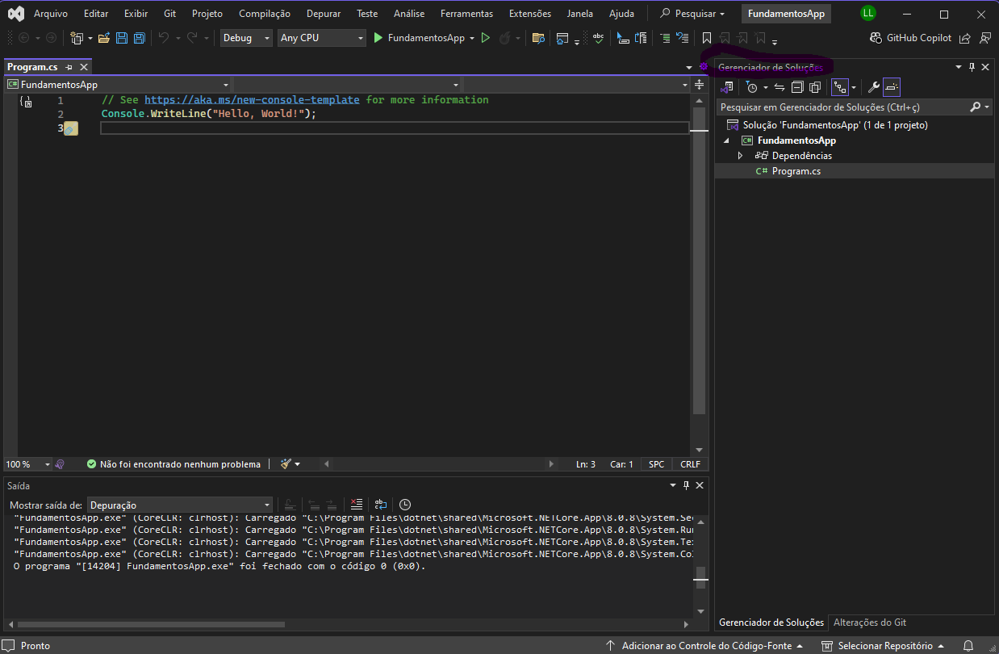

# Básico para iniciar com visual studio

## Tela inicial do Visual Studio

Na primeira vez que você abre o Visual Studio, verá a tela inicial. Nela, você pode criar novos projetos, abrir projetos existentes, e explorar exemplos e tutoriais. Aqui estão as opções principais:

Tela inicial do visual studio 2022

- Create a new project: Inicia um novo projeto.
- Open a project or solution: Abre um projeto existente.
- Recent projects: Lista de projetos recentes.

### Criando um Novo Projeto

Ao criar um novo projeto, você verá a janela "Create a new project", onde poderá escolher o tipo de projeto (como um aplicativo console, aplicativo Windows Forms, ASP.NET, etc.).

Passo 1: Escolha o tipo de projeto desejado (Console App, Windows Forms, etc.).
Passo 2: Dê um nome ao projeto e escolha o local de armazenamento.

### Explorador de Soluções (Solution Explorer)

O Solution Explorer é onde você gerencia os arquivos e projetos do seu aplicativo, você pode ver por exemplo.

Ver todos os arquivos do projeto.
Adicionar, remover e renomear arquivos.
Gerenciar referências e bibliotecas.

### Janela de Código (Code Editor)

A janela de código é onde você escreve o código. Visual Studio possui muitos recursos úteis para facilitar a codificação, como:

Numeração de linhas: Exibe o número de cada linha, ajudando a localizar partes específicas do código.
Destaque de sintaxe: Coloriza palavras-chave, variáveis e tipos de dados para melhor leitura do código.
IntelliSense: Sugere autocompletar para comandos, funções e variáveis enquanto você digita.

### Barra de Ferramentas
A barra de ferramentas contém botões para comandos básicos, como:

Run/Debug (Start): Inicia a execução do projeto. É representado por um ícone de "Play".
Save All: Salva todas as alterações feitas nos arquivos.
Build Solution: Compila todo o projeto para verificar se há erros no código.
Stop Debugging: Para a execução do aplicativo em execução.

### Janela de Saída (Output Window)

A janela de saída mostra mensagens sobre a compilação, como erros, avisos, e mensagens de status do processo de build.

Como abrir: Menu View > Output.

### Janela de Erros (Error List)
A Error List mostra todos os erros, avisos e mensagens durante a compilação do projeto, ajudando a localizar e corrigir problemas.

Como abrir: Menu View > Error List.
Dica: Clique duas vezes em um erro para ir diretamente para a linha de código correspondente.

### Janela de Propriedades (Properties Window)
A Properties Window permite configurar as propriedades dos componentes do projeto, como formulários, botões, ou outros elementos da interface do usuário.

Como abrir: Clique em um componente na Solution Explorer ou na interface gráfica e pressione F4.

### Debugging Básico
O Debugging ajuda a identificar problemas no código. Os comandos básicos incluem:

Breakpoints: Clique no lado esquerdo do editor de código para adicionar um ponto de interrupção. O programa pausará aqui durante a execução para você inspecionar variáveis e lógica.
Step Over (F10): Avança para a próxima linha de código, permitindo analisar o fluxo do programa passo a passo.

### Terminal (Command Prompt)

No Visual Studio, você pode acessar o Command Prompt para executar comandos do sistema, como iniciar um servidor, compilar manualmente um projeto, etc.

Como abrir: Menu View > Terminal.

